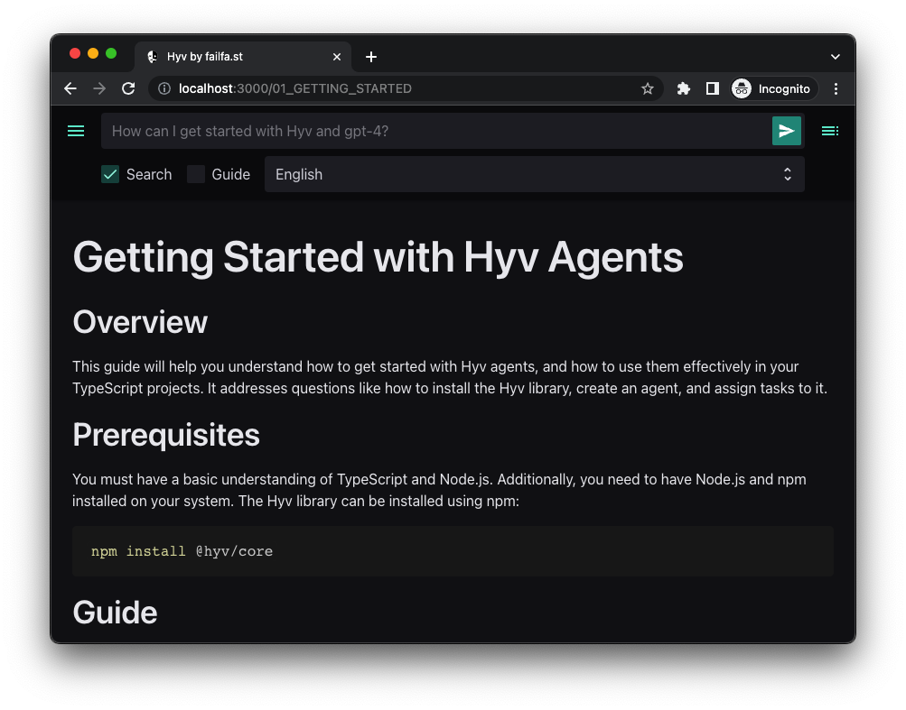
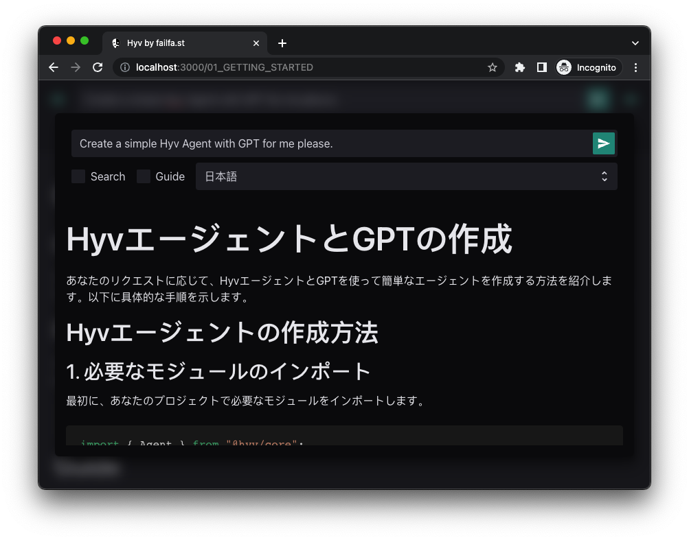

# Hyv: The Hub for Your AI Models

<p align="center"></p>

[](https://discord.com/invite/m3TBB9XEkb)
[](https://app.codacy.com/gh/failfa-st/hyv/dashboard?branch=main)
[](https://app.codacy.com/gh/failfa-st/hyv/dashboard?branch=main)

[](https://www.npmjs.com/package/@hyv/core)
[](https://www.npmjs.com/package/@hyv/utils)
[](https://www.npmjs.com/package/@hyv/openai)
[](https://www.npmjs.com/package/@hyv/store)
[](https://www.npmjs.com/package/@hyv/stable-diffusion)

## Welcome to Hyv

Hyv is a versatile library designed to streamline the integration and interaction of diverse AI
models. With a clean, intuitive, and unified API, Hyv allows developers to manage and collaborate
with various AI models effortlessly.

Get started with Hyv now:

```shell
npm i @hyv/core @hyv/openai
```

Then, provide your apiKey in a `.env` file

```shell
OPENAI_API_KEY=sk-xxxxxxxx
```

Try this simple example to experience Hyv in action:

```ts
import { Agent } from "@hyv/core";
import { GPTModelAdapter, DallEModelAdapter } from "@hyv/openai";

// Create agents
const writer = new Agent(new GPTModelAdapter());
const artist = new Agent(new DallEModelAdapter(), {
    // Preprocess the task
    async before(message) {
        return { images: [{ path: "the-future.png", prompt: message.answer }] };
    },
});

// Assign tasks
const writerResult = await writer.assign({
    question: "Describe the future to an artist so that they can draw it",
});
const artistResult = await artist.assign(writerResult.message);
// Do something with the result
console.log(artistResult.message.content);
```

## Experience the Power of Hyv: Learn through Interaction in 11 Languages!



Dive into Hyv's universe with our interactive, multilingual docs. Powered by Hyv agents and GPT-4,
they turn learning into a dynamic experience. Understand Hyv's features by engaging with them in
real-time across 11 languages. Simple setup, profound learning. Start your journey with our
[easy setup guide](RUNNING_DOCS_LOCALLY.md) now!

## Explore Hyv

-   **[Examples](examples)**: Discover practical applications and use-cases of Hyv.
-   **[Documentation](pages)**: Dive deep into detailed guides and extensive documentation.
-   **[Lingo](https://github.com/failfa-st/lingo/)**: Enhance your usage of large language models
    with Lingo, an efficient pseudo-language.
-   **[Discord](https://discord.com/invite/m3TBB9XEkb)**: Join our community, share your work, and
    learn from others.

## Why Choose Hyv?

Hyv is an all-in-one solution for developers:

-   **Streamlined Task Management**: Handle complex tasks involving multiple AI models seamlessly.
-   **Flexible, Plug-and-play Architecture**: Integrate Hyv into any tech stack with ease. Adapt it
    to your specific needs.
-   **Broad Compatibility**: Hyv supports diverse AI models, offering limitless possibilities.

Embrace the future with Hyv today!
