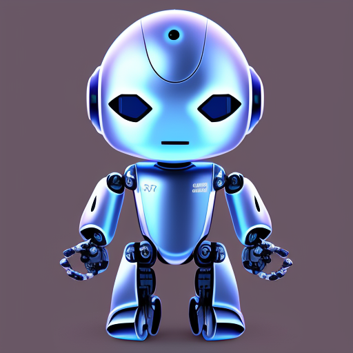

<h1 align="center"><big>Hyv</big></h1>

<p align="center"></p>


Hyv is a modular software development library centered on AI collaboration that streamlines the development process by breaking complex tasks into manageable pieces. Its adaptable design works with various technologies, making it a versatile choice for developers. By fostering efficient task management through AI collaboration and offering extensive documentation, Hyv represents a paradigm shift in AI-assisted software development.

## Features 🌟

- 🚀 **Streamlined Task Management**: Hyv enhances your projects with efficient task distribution and coordination, simplifying resource utilization.
- 🧩 **Flexible Modular Design**: Hyv's modular architecture allows seamless integration of various tools, models, and adapters, providing a customizable solution.
- 🌐 **Broad Compatibility**: Designed for various technologies, Hyv is a versatile option for developers working with diverse platforms and frameworks.
- 📚 **Comprehensive Documentation**: Hyv includes detailed documentation and examples, aiding in understanding its features and effective implementation in projects.
- 🌱 **Community-Driven**: Hyv is developed and maintained by a devoted community of developers, continually working to refine and extend its capabilities.

## Usage

> ⚠️ This library has not yet been released, but it can be expected to work like this:

```shell
npm install "@hyv/core" "@hyv/openai" "@hyv/store"
```

```typescript
import process from "node:process";
import { Agent, createInstruction, sprint } from "@hyv/core";
import type { ModelMessage } from "@hyv/core";
import { DallEModelAdapter, GPTModelAdapter } from "@hyv/openai";
import type { DallEOptions, GPT3Options } from "@hyv/openai";
import { createFileWriter, FSAdapter } from "@hyv/store";
import { config } from "dotenv";
import { Configuration, OpenAIApi } from "openai";

config();

export const openai = new OpenAIApi(
  new Configuration({
    apiKey: process.env.OPENAI_API_KEY,
  })
);

const dir = "out/book";
const store = new FSAdapter(dir);
const fileWriter = createFileWriter(dir);
const book: ModelMessage & { title: string } = {
  title: "The future and beyond",
};

const author = new Agent(
  new GPTModelAdapter<GPT3Options>({
    model: "gpt-3.5-turbo",
    temperature: 0.5,
    maxTokens: 2048,
    historySize: 1,
    systemInstruction: createInstruction(
      "Scientific Author",
      "Write a story and describe required illustrations in detail",
      {
        illustrations: "string[]",
        files: [{ path: "string", content: "markdown" }],
      }
    ),
  }),
  store,
  { tools: [fileWriter] }
);

const illustrator = new Agent(
  new DallEModelAdapter<DallEOptions>({
    size: "1024x1024",
    n: 1,
    systemInstruction: createInstruction("Illustrator", "Create illustrations for the chapter.", {
      files: [{ path: "string", content: "string" }],
    }),
  }),
  store,
  { tools: [fileWriter] }
);

try {
  const messageId = await store.set(book);
  await sprint(messageId, [author, illustrator]);
  console.log("Done");
} catch (error) {
  console.error("Error:", error);
}
```

👇 While we develop this library, have fun reading this story written by one of our Hyv authors:

## The Future and Beyond


The year is 2050, and the world has changed drastically. With the rise of technology and the
ever-growing demand for sustainability, humans have adapted to a new way of life. Cities have
transformed into towering metropolises, with skyscrapers reaching the clouds and transportation
systems that hover above the ground. The streets are clean, and the air is pure, thanks to the
advancements in renewable energy.

<br clear="left"/>


In this new world, space travel has become a common occurrence. Spaceships regularly depart from
Earth to explore the vast expanse of the universe. Humans have even established colonies on other
planets, where they continue to push the boundaries of science and technology.

<br clear="right"/>


But it's not just humans who have evolved. Robots have become an integral part of society, with
advanced AI that can perform tasks beyond human capabilities. They work alongside humans, helping to
build and maintain the cities of the future.

As we look to the future and beyond, we can only imagine what other marvels await us. But one thing
is for sure, with our determination and ingenuity, we will continue to push the limits of what is
possible.
